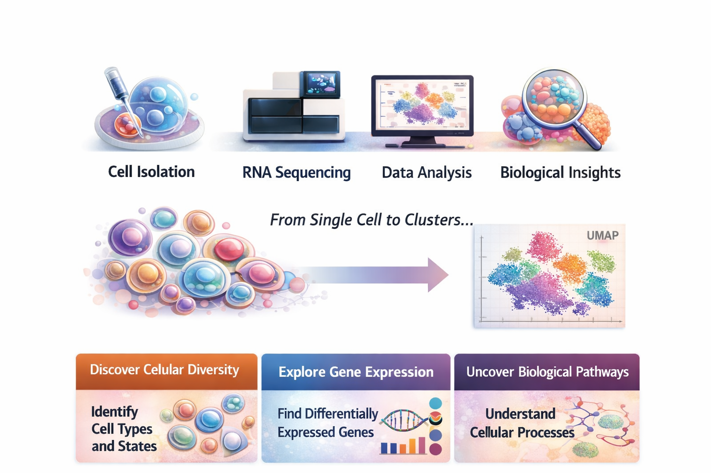

# Taller scRNA-seq
### El Arkhe · Talleres Multiomics

Este repositorio contiene el material del **Taller de análisis de single-cell RNA-seq (scRNA-seq)** 

  

El contenido está diseñado para formación técnica con énfasis en:
- comprensión conceptual del análisis single-cell
- reproducibilidad
- buenas prácticas computacionales
- lectura crítica de datos y resultados
- uso de referencias bibliográficas relevantes

---

## Estructura

- [`Datos single-cell`](data/) — Acceso a diversos datasets single-cell o otros tipos de datos relacionados
- [`Codigo R/Python/HTML](/scripts/README.md) — Scripts con codigo para reproducibilidad del taller
- [`Material`](/docs/README.md) — Material teórico, guías del taller y ejercicios de práctica relacionados
- [`Environment`] — Entornos reproducibles  

---

## Clonar repositorio

- [`Github repo`](docs/main_docs/09_github_repo.md)

---

## Autora y curaduría
**Cyntia S. Cardinault**  
GitHub: https://github.com/cyntsc  

Este repositorio es mantenido por la autora en representación de **El Arkhe**.

Si utiliza material del taller, código o recursos asociados en su investigación, enseñanza u obras derivadas, por favor cítelo de la siguiente manera.

### Cita preferida

Cynthia S. Cardinault. *El Arkhe: Single-Cell RNA-seq Workshop*.  
GitHub repository: https://github.com/<cyntsc>/<scrnaseq-workshop>  
2026.

Un archivo de citación legible por máquina está disponible en este repositorio:

- [`CITATION.cff`](./CITATION.cff)

GitHub generará automáticamente formatos de citación (BibTeX, APA, etc.) desde este archivo a través del botón **"Cite this repository"**.

### Referencias relacionadas

Si utiliza datos, métodos o herramientas específicas presentadas en este taller, por favor cite también las publicaciones primarias correspondientes (por ejemplo, Seurat, Scanpy, edgeR, 10x Genomics Cell Ranger), como se indica a lo largo de los materiales del taller.

## Estado del proyecto
🚧 Repositorio en desarrollo  
El contenido se irá liberando progresivamente conforme a los talleres y ediciones del curso.

---

© El Arkhe · Talleres Multiomics
