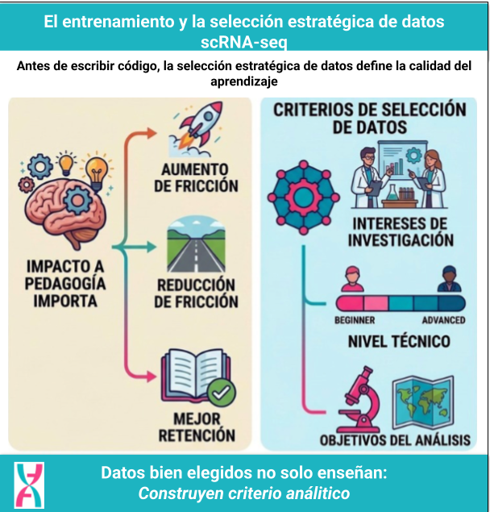

# El entrenamiento y la selección estratégica de datos scRNA-seq

¿Por qué la selección estratégica de datos en scRNA-seq es clave para el entrenamiento?

El entrenamiento en análisis de datos ómicos como **scRNA-seq**  se enfoca principalmente en herramientas, pipelines y algoritmos. Sin embargo, uno de los factores más determinantes en el aprendizaje es la **selección de los datos con los que se entrena**.

  

> Antes de escribir una sola línea de código, la calidad de la experiencia de aprendizaje ya está siendo definida por el tipo de datos elegidos.

---

## El diseño y la pedagogía importan

El diseño instruccional y la selección adecuada de datos no solo transmiten conocimiento técnico, sino **facilitan la inmersión en el proceso de aprendizaje**.

Cuando los contenidos, ejercicios y datos están alineados con el contexto del estudiante:

- Se reduce la fricción inicial  
- Se incrementa la motivación  
- Se favorece la retención  

En el aprendizaje de datos ómicos, esto significa que no basta con usar “cualquier conjunto de datos público”. Es necesario **elegirlos estratégicamente**.

---

## Rol crítico de la selección de datos scRNA-seq en el aprendizaje

Recomendamos utilizar datos específicos alineados, en la medida de lo posible, a:

- Intereses de investigación del grupo  
- Nivel técnico de los participantes  
- Objetivos del análisis (flujo completo vs flujos específicos avanzados)  

**"Los datos bien elegidos permiten construir criterio analítico"**

---

## Datos curados y reales para aprendizaje

En *El Arkhe* partimos de una premisa clara: *no todos los datos enseñan lo mismo*.

El diseño instruccional no solo define *qué enseñar*, sino también con qué datos se construye el criterio analítico.
Elegir datos no es una decisión técnica menor, es una **decisión pedagógica central**.

Por ello, mantenemos una "curaduría activa de datos", seleccionados estratégicamente para acompañar la progresión del aprendizaje:
- Desde sistemas altamente estandarizados que facilitan la comprensión inicial
- Hasta contextos biológicos complejos que exigen interpretación, criterio y pensamiento crítico.

Este enfoque permite transitar de ejecutar *workflows* a entender profundamente los datos y sus implicaciones biológicas.

Más que una comparación técnica, la siguiente tabla funciona para ilustrar una guía pedagógica estudiada para seleccionar datos según el objetivo de aprendizaje:

| Mammalia 10x Genomics | Human Brain Lieber Institute | Arabidopsis plantScGRN |
| --- | --- | --- |
| Marcadores bien definidos           | Marcadores menos evidentes                | Marcadores limitados y emergentes                                  |
| Tipos celulares del sistema inmune  | Tipos celulares específicos de cerebro    | Identidades celulares definidas por tejido (root, leaf, vascular)  |
| Anotación más sencilla              | Análisis más interpretativo               | Anotación basada en contexto de desarrollo                         |
| Células (scRNA-seq)                 | Núcleos (snRNA-seq)                       | Principalmente células (protoplasting requerido)                   |
| Datasets estándar de referencia     | Datasets enfocados en investigación       | Datasets en rápida evolución con menor estandarización             |
| Alta disponibilidad de referencias  | Disponibilidad moderada de referencias    | Referencias fragmentadas entre estudios                            |
| Fuerte consenso en la comunidad     | Requiere experiencia específica del campo | Requiere conocimiento en biología vegetal                          |
| Separación clara de tipos celulares | Diferencias transcripcionales sutiles     | Transiciones graduales de estado celular (developmental gradients) |

## Exploración de curaduría dedatos

Como parte del taller, trabajamos con una curaduría de datos seleccionados estratégicamente para cubrir distintos niveles de aprendizaje:

### Datos de 10x Genomics
- Flujos completos desde datos crudos (FASTQ)  
- Introducción al *pipeline* estándar con *Cell Ranger*  
- Base para aprendizaje estructurado y reproducible  

### Datos del Lieber Institute (human brain)
- Datos enfocados en la *habenula humana*  
- Conexión directa con investigación real  
- Ejemplo de análisis en sistemas biológicos complejos  

### Datos de planta *Arabidopsis*
- Alternativa para contextos agrícolas y biología vegetal  
- Enfoque en desarrollo, diferenciación y regulación génica  
- Ideal para transicionar hacia análisis interpretativo  

> La colección completa de datasets y recursos está disponible para los participantes del taller o bajo solicitud directa.

---

## Experiencia de aprendizaje efectiva

El flujo de trabajo enfocado en incorporar datos alineados a los intereses del grupo de participantes, así como ajustes pertinentes a su nivel técnico, permite:

- Comprensión conceptual sólida  
- Práctica técnica contextualizada  
- Mayor autonomía en análisis  

Y, sobre todo, una **inmersión de aprendizaje más enriquecedora que promueve el aprendizaje continuo**.

---

## Reflexión final

En scRNA-seq, aprender no es solo ejecutar *pipelines*.  
Es interpretar datos, formular preguntas y generar conocimiento.

**Y ese proceso comienza con la elección correcta de los datos y un diagnóstico preciso del nivel del participante.** Aspecto fundamental de nuestro diseño pedagógico en los talleres de *El Arkhe MultiOmics*.

---

## ¿Te interesa este enfoque?

¿Te gustaría colaborar, aportar datos o conocer más sobre nuestra propuesta formativa?  
📩 Escríbenos a [elarkhe@gmail.com](mailto:elarkhe@gmail.com)

Explora nuestros talleres de análisis de datos ómicos: [Índice de talleres](/talleres/indice_talleres/)

Ver la curaduría de datos:
[Explorar datos](https://github.com/el-arkhe/scrnaseq-workshop/blob/main/data/README.md)

---

## ¿Te interesa la próxima edición del taller de scRNA-seq?

Registrate para recibir más información sobre la próxima edición del taller, incluyendo fechas, temario y detalles de inscripción.

👉 [**Registrarse al taller**](/talleres/registro/)

---

## Referencias y recursos

- Transcriptomic Analysis of the Human Habenula in Schizophrenia  
  American Journal of Psychiatry  
  https://psychiatryonline.org/doi/10.1176/appi.ajp.20240776  

- Supporting open-access version (PMC)  
  https://pmc.ncbi.nlm.nih.gov/articles/PMC11119547/  

- 10x Genomics Datasets Repository  
  https://www.10xgenomics.com/datasets  

---

Cynthia S Cardinault (2026). El entrenamiento y la selección estratégica de datos scRNA-seq. *El Arkhe MultiOmics*.
