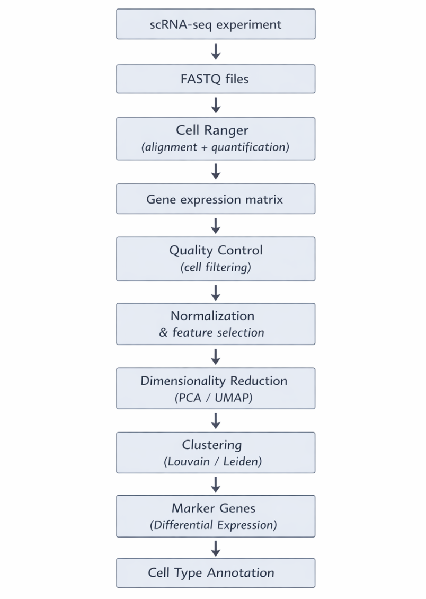

# Taller de análisis de célula única (single-cell RNA-seq)

Tecnologías utilizadas:\
Cell Ranger • Seurat v5 • R • Single-Cell RNA-seq • 10x Genomics

---

Este taller introduce los principios conceptuales y prácticos del análisis de datos de **single-cell RNA sequencing (scRNA-seq)** utilizando datasets públicos generados con la plataforma **Chromium de 10x Genomics**.

El contenido sigue el flujo estándar de análisis utilizado en estudios modernos de transcriptómica a nivel celular, comenzando con el procesamiento de datos crudos y culminando con la identificación de tipos celulares y la interpretación biológica de los resultados.

A lo largo del taller los participantes trabajarán con un conjunto de datos real y recorrerán paso a paso las etapas principales del análisis:

1. Procesamiento de datos crudos con `Cell Ranger`
2. Control de calidad y filtrado de células
3. Integración de múltiples datasets
4. Reducción de dimensionalidad y clustering
5. Identificación de tipos celulares mediante genes marcadores

Cada módulo combina **conceptos teóricos** con **prácticas guiadas en R utilizando Seurat v5**, permitiendo a los participantes comprender tanto la lógica estadística del análisis como su implementación práctica.

Duración total del taller: **20 horas efectivas** distribuidas en **5 sesiones**.

## Material teórico y guías

[Requerimientos Técnicos](/docs/requerimientos.md)\
[Guía de preparación del entorno de análisis](/docs/guide_env.md)\
[Videos seleccionados para apoyo pedagógico](/docs/videos_tutoriales.md)\
[Referencias bibliográficas y posts seleccionadas](/docs/referencias_seleccionadas.md)

## Índice del Taller

### Día 1: Introducción a scRNA-seq y procesamiento con Cell Ranger

- [1.1 Introducción a scRNA-seq](main_docs/day1/01_introduccion_sc_rnaseq.md)
  - [Plataforma Chromium de 10x Genomics](main_docs/day1/01a_chromiun_platforms.md)

- [1.2 Preprocesamiento de datos scRNA-seq con Cell Ranger](main_docs/day1/02_preprocessing_scrnaseq_datasets.md)
  - [Comprendiendo las Químicas Chromium 3′: v3.1 vs GEM-X v4](main_docs/day1/02a_seleccion_datos_chromium_sc.md)

  - *Práctica 1.P1:* Procesamiento de datos scRNA-seq en 10x Genomics on the Cloud  
    **Lecturas previas:** 1.1, 1.2

- [1.3 Submuestreo (Subsampling) con flujos de trabajo `Cell Ranger`](main_docs/day1/04_subsampling.md)
  - [Análisis de resultados con y sin submuestreo](main_docs/04a_subsampling.md)  

  - *Práctica 1.P2:* Análisis comparativo de resultados de submuestreo  
    **Lectura previa:** 1.3

**Prácticas:** 

- [1.P1: procesamiento de datos scRNA-seq en 10x Genomics on the Cloud](main_docs/day1/03_procesamiento_10Xgenomics_cloud.md)  
  Recursos de apoyo:
  - [Descarga y carga de datos FASTQ desde `10x Genomics Datasets` a `10x Genomics on the Cloud`](main_docs/day1/03a_upload_files.md)
  - [Descarga de datos procesados en `Cell Ranger on the Cloud`](main_docs/03b_download_10X_cloud.md)

- [1.P2: Análisis comparativo de resultados de submuestreo](main_docs/day1/05_cell_ranger_analisis_comparativo_subsampling.md)

---

### Día 2: Control de calidad y filtrado de células

2.1 Comprensión de las matrices de expresión genética de Cell Ranger\
2.2 Seurat v5\
2.3 Exploración inicial de datos\
2.4 Métricas de control de calidad de Cell Ranger\
2.5 Otras métricas de control de calidad establecidas\
2.5.1 Empty Droplet Detection\
2.5.2 Ambient RNA Correction\
2.5.3 Doublet Detection\
2.6 Filtrado de calidad a nivel celular (Cell-level QC filtering)\
2.7 Filtrado de control de calidad a nivel genético\
2.8 Normalización y selección de características variables (Feature selection)\
2.9 Dataset limpio y filtrado tras control de calidad

---

### Día 3: Integración de datasets y corrección de batch effects

3.1 Integración de más datos scRNA-seq\
3.2 Corrección de Batch effects\
3.3 Métodos de visualización e integración de datos

---

### Día 4: Reducción de dimensionalidad y clustering

4.1 Reducción de dimensionalidad en scRNA-seq\
4.2 Construcción del grafo celular\
4.3 Métodos de clustering

---

### Día 5: Identificación de tipos celulares e interpretación biológica

5.1 Identificación de genes marcadores\
5.2 Identificación de tipos celulares\
5.3 Expressión diferencial entre clusters\
5.4 Interpretación biológica de resultados\
5.5 Temas avanzados de análisis scRNA-seq

## Resultado esperado del taller

Los participantes aprenderán a:

- Procesar datos scRNA-seq utilizando `Cell Ranger`
- Explorar matrices de expresión génica
- Aplicar métricas de control de calidad
- Integrar múltiples datasets
- Identificar poblaciones celulares mediante clustering
- Anotar tipos celulares utilizando genes marcadores

## Flujo estándar del análisis

  

---

#### Para más información escribenos a <a href="mailto:elarkhe@gmail.com">elarkhe@gmail.com</a>

---

© 2026 El Arkhe MultiOmics · México

