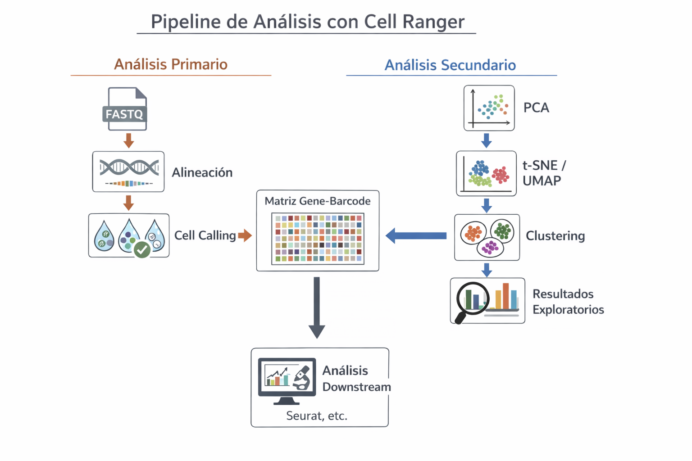

# Preprocesamiento de datos scRNA-seq con Cell Ranger

Para experimentos de **single-cell RNA sequencing (scRNA-seq)** generados con la plataforma **10x Genomics Chromium**, el flujo de trabajo estándar de preprocesamiento se realiza utilizando **Cell Ranger**.

**Cell Ranger** es un conjunto de herramientas bioinformáticas diseñado para procesar datos de secuenciación crudos y generar matrices de expresión génica listas para análisis downstream (por ejemplo, en Seurat o Scanpy).

Este paso corresponde al **análisis primario** y es crítico para garantizar:
- Identificación correcta de células reales  
- Asignación precisa de barcodes y UMIs  
- Métricas de calidad confiables  

## ¿Qué es Cell Ranger?

Cell Ranger procesa datos provenientes de experimentos scRNA-seq de 10x Genomics y automatiza tareas clave como:

- Conversión de archivos BCL a FASTQ  
- Alineación a un genoma de referecia o transcriptoma  
- Clasificación de celulas (Cell calling)   
- Conteo de UMIs por gen y por célula  
- Generación de reportes de calidad  

## Flujo general de Cell Ranger

El flujo de trabajo típico de Cell Ranger se compone de varios comandos, cada uno con un propósito específico:

| Paso | Comando | Función principal | Output |
|----|--------|------------------|--------|
| 1 | `cellranger mkfastq` | Convierte archivos BCL en FASTQ y realiza demultiplexing por muestra y lane | FASTQ files |
| 2 | `cellranger count` | Pipeline principal: alineación, identificación de barcodes y UMIs, cell calling y conteo | Gene-Barcode Matrix, BAM, Web Summary HTML, `.cloupe` |
| 3 | `cellranger aggr` | Agrega múltiples corridas independientes en una sola matriz | Aggregated Gene-Barcode Matrix |

### Paso 1: `cellranger mkfastq`

Este comando:
- Toma como entrada archivos **BCL** generados por el secuenciador
- Realiza **demultiplexing**
- Produce archivos **FASTQ comprimidos**

Output principal:
- FASTQ files (R1, R2, I1)

Este paso es equivalente, conceptualmente, a `bcl2fastq`, pero optimizado para flujos de trabajo de 10x Genomics.

### Paso 2: `cellranger count`

Este es el flujo de procesamiento (pipeline) central, con las siguientes funciones principales:

- Alineación de lecturas a un reference genome/transcriptome  
- Identificación de **Cell Barcodes (CBs)** y **Unique Molecular Identifiers (UMIs)**  
- Clasificación de células (cell calling)  
- Conteo de moléculas por gen y por célula  

Output clave:
- **Filtered feature-barcode matrix** (H5 y MTX)
- BAM file
- Web Summary (HTML)
- Archivo `.cloupe` para exploración interactiva

## Análisis secundario

Además del análisis primario (alineación, conteo de UMIs y *cell calling*), los comandos `cellranger count`, `cellranger aggr` y `reanalyze` generan resultados de **análisis secundarios automatizados** que permiten explorar la estructura global del dataset.

  

Estos análisis se realizan sobre la **matriz de expresión filtrada y normalizada** e incluyen:

- **Principal Component Analysis (PCA)** para reducir la dimensionalidad del dataset.
- **t-SNE o UMAP** para visualizar las células en un espacio bidimensional.
- **Clustering** para agrupar células con perfiles de expresión similares.

En primer lugar se aplica **PCA**, utilizando únicamente **features de expresión génica**, para proyectar cada célula en un espacio de menor dimensionalidad. Por defecto se calculan los primeros componentes principales que capturan la mayor variación en los datos.

A partir de esta representación en espacio PCA se generan visualizaciones 2-D mediante **t-SNE** o **UMAP**, lo que permite explorar la organización global de las células.

Posteriormente se realiza el **clustering**, donde Cell Ranger aplica dos estrategias:

- **Graph-based clustering**, que identifica comunidades celulares sin especificar previamente el número de clusters.
- **K-means clustering**, evaluando distintos valores de **K** (número de clusters), típicamente entre **K = 2 y 10**.

⚠️ **Nota:** estos resultados son exploratorios y sirven principalmente para inspección inicial de los datos. El análisis downstream detallado suele realizarse posteriormente en herramientas como **Seurat** o **singleCellExperiment**.

## Proceso de análisis secundario con `cellranger aggr`

El comando `cellranger aggr` permite **integrar múltiples datasets previamente procesados con `cellranger count`** en un único conjunto de datos combinado.

Este comando toma como entrada las matrices de expresión generadas por `cellranger count`, normaliza las muestras para corregir diferencias en **profundidad de secuenciación**, y posteriormente recalcula los **análisis secundarios** (PCA, UMAP/t-SNE y clustering) sobre el dataset agregado.

Se utiliza principalmente cuando se desea:

- Integrar múltiples muestras o donadores  
- Combinar corridas provenientes de diferentes lanes  
- Analizar experimentos replicados  

Output principal:

- **Aggregated Gene-Barcode Matrix**
- **Web Summary agregado**

## Resultados principales de Cell Ranger

En resumen, el resultado central del preprocesamiento es obtener la matriz de conteos **Filtered feature-barcode matrix** (H5 o MTX) y el `Web Summary` con métricas de calidad con paso inicial exploratorio.

Estos outputs son la base para:
- QC downstream
- Clustering refinado
- Identificación de cell types
- Análisis diferencial

La exploración inicial puede realizarse con **Loupe Browser**, aunque el análisis formal se hace usualmente en R o Python.

## Modos de correr Cell Ranger

Cell Ranger puede ejecutarse de diferentes formas dependiendo de la infraestructura disponible:

- Local
- HPC
- Cloud

Puedes consultar el resumen de modos de ejecución [aquí](https://cyntsc.github.io/single_cell_RNA-seq/RunModes/)

## Cell Ranger y Galaxy

Es posible ejecutar `Cell Ranger` dentro de **Galaxy**, pero con consideraciones importantes:

- Cell Ranger es software propietario de 10x Genomics
- Las instancias públicas de Galaxy **no siempre lo incluyen por defecto**
- Su disponibilidad depende de licencias y recursos locales

Ejemplo:
- Galaxy Australia ofrece Cell Ranger bajo **acceso controlado** mediante solicitud específica

Como alternativa dentro de entornos Galaxy, es común utilizar herramientas open-source, como **STARsolo**:

- Requiere FASTQ (R1, R2, I1)
- Produce outputs compatibles con el formato de Cell Ranger
- Facilita el análisis downstream en pipelines estándar

## Recursos de consulta

- Comenzando con Cell Ranger:\
  https://www.10xgenomics.com/support/software/cell-ranger/latest/getting-started
- Analysis steps:\
  https://www.10xgenomics.com/support/software/cell-ranger/latest/analysis/running-pipelines/cr-gex-count#analysis-steps
- Secondary analysis pipelines: \
  https://www.10xgenomics.com/support/software/cell-ranger/latest/analysis/running-pipelines/cr-choosing-a-pipeline#secondary-pipelines
- Modos de ejecución Cell Ranger:  
  https://cyntsc.github.io/single_cell_RNA-seq/RunModes/

---

CSC. Marzo 06, 2026