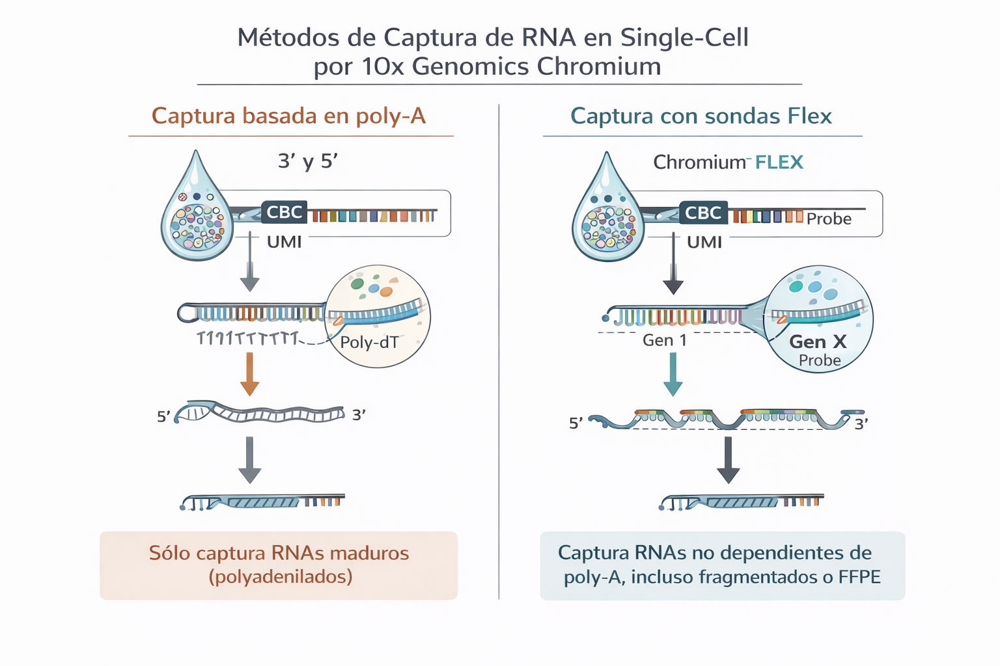

# Comprendiendo las Químicas Chromium 3′: v3.1 vs GEM-X v4
### Universal 3′, Universal 5′ y Flex

Las tecnologías Chromium single-cell de 10x Genomics permiten perfilar la expresión génica a nivel de célula individual utilizando distintas químicas, diseñadas para responder a preguntas biológicas y restricciones experimentales específicas. Las más comunes son **Universal 3′**, **Universal 5′** y **Chromium Flex**.

### Universal 3′ Gene Expression

Esta química captura el extremo 3′ del mRNA mediante poly-A capture, generando un conteo de UMIs por gen.

Características principales:

* Transcriptoma completo (gene-level)
* Captura basada en cola poly-A
* No permite distinguir isoformas
* No recupera secuencias completas de TCR/BCR (*)

Uso recomendado
* Atlas celulares
* Identificación de tipos y estados celulares
* Análisis de clustering, integración y expresión diferencial

Es la opción estándar y más utilizada en estudios de scRNA-seq.

(*)TCR y BCR se refieren a los receptores de los linfocitos, es decir, las moléculas que usan las células del sistema inmune para reconocer antígenos

### Universal 5′ Gene Expression

Esta química captura el extremo 5′ del mRNA, manteniendo la posibilidad de realizar immune profiling.

Características principales:

* Transcriptoma completo
* Captura basada en poly-A
* Compatible con V(D)J sequencing
* Permite recuperar secuencias completas de TCR y BCR

Uso recomendado
* Inmunología
* Cáncer
* Estudios de clonalidad
* Integración de expresión génica con identidad del receptor inmune

Es ideal cuando se necesita combinar expresión génica + información inmunológica.

### Chromium Flex (Fixed RNA Profiling)

Chromium Flex es un enfoque targeted, basado en sondas, diseñado para trabajar con muestras fijadas.

Características principales:

* No depende de poly-A
* Utiliza paneles de genes predefinidos o personalizados
* Compatible con células o núcleos fijados
* Alta reproducibilidad entre lotes

Limitaciones
* No captura el transcriptoma completo
* El análisis depende del diseño del panel
* Menor capacidad de descubrimiento

Uso recomendado
* Muestras clínicas
* Biobancos
* Estudios longitudinales
* Situaciones donde la logística o preservación de la muestra es crítica

Flex prioriza robustez experimental sobre amplitud transcriptómica. 

    Las químicas Universal Expression 3′ y 5′ capturan RNA mediante hibridación a la cola poly-A del mRNA, mientras que Chromium Flex utiliza sondas específicas de genes y no depende de la presencia de poly-A para capturar transcriptos.

  

## Comparación general

| Característica | Universal 3′ | Universal 5′ | Flex |
|---------------|--------------|--------------|------|
| Tipo de captura | 3′ end | 5′ end | Sondas |
| Poly-A | Sí | Sí | No |
| Transcriptoma completo | Sí | Sí | No |
| TCR/BCR | No | Sí | No |
| Muestras fijadas | No | No | Sí |
| Enfoque | Descubrimiento | Inmunología | Targeted / clínico |

### Guía rápida de decisión

La selección de la química (Universal 3′, Universal 5′ o Flex) define cómo se captura el RNA, mientras que las “Additional applications” (proteínas, multiplexing, CRISPR, throughput) determinan qué capas adicionales de información estarán disponibles para el análisis.

Como guía básica de seleccion inicial puedes preguntarte:

* Quiero explorar el transcriptoma completo → `Universal 3′`
* Quiero transcriptoma + clonotipos inmunes → `Universal 5′`
* Trabajo con muestras fijadas o clínicas → `Chromium Flex`

## Recursos de consulta

- Chromium Single Cell 3′ Gene Expression
    Documentación técnica de la química 3′, captura poly-A y casos de uso.
    https://www.10xgenomics.com/products/single-cell-gene-expression

-  Chromium GEM-X Single Cell 3' v4 Gene Expression User Guide
    https://cdn.10xgenomics.com/image/upload/v1725314293/support-documents/CG000731_ChromiumGEM-X_SingleCell3v4_UserGuide_RevB.pdf

- Chromium Single Cell 5′ Gene Expression & Immune Profiling
    Descripción de la química 5′ y su integración con V(D)J sequencing (TCR/BCR).
    https://www.10xgenomics.com/products/single-cell-immune-profiling

- Chromium Single Cell Fixed RNA Profiling (Flex)
    Descripción oficial del enfoque targeted basado en sondas y muestras fijadas.
    https://www.10xgenomics.com/products/flex-gene-expression

---

CSC. Enero 31, 2026
