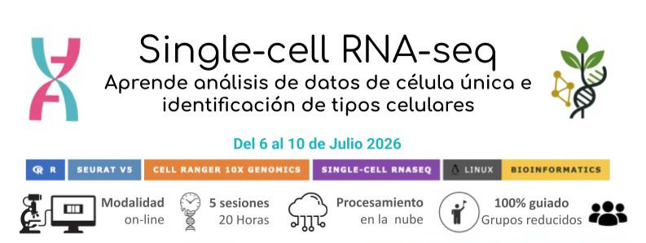

# Taller de análisis de célula única (scRNA-seq)

Aprende a analizar datos de célula única desde archivos **FASTQ** hasta la **identificación de tipos celulares**, combinando teoría y práctica en un flujo real de trabajo.

📅 6–10 de julio de 2026  
⏱️ 20 horas (5 sesiones en vivo)  
🧪 Modalidad: Online

Impartido por especialistas en análisis multi-ómico con experiencia en datos de 10x Genomics (scRNA-seq, scATAC-seq y spatial resolved transcriptomics) y proyectos reales de investigación.

👉 **[Formulario de registro](https://forms.gle/2ZXXXXXXXXXXXX)**

🕒 Registro abierto hasta llenar cupo

  

---
### ¿Qué hace diferente este taller?

- 🧬 **Flujo completo**: desde datos crudos (FASTQ) hasta interpretación biológica  
- ☁️ **Sin HPC**: procesamiento en la nube con 10x Genomics  
- 🔍 **Datos reales**: no trabajamos con datasets simplificados  
- 🎓 **Ritmo realista**: aprendizaje profundo en 20 horas efectivas  
- ⚙️ **Reproducibilidad**: prácticas alineadas a estándares de publicación  
- 👩‍🏫 **Sesiones en vivo** con acompañamiento guiado  

###  ¿Qué aprenderás?

Durante el taller trabajarás con un dataset real y recorrerás paso a paso:

1. Procesamiento de datos crudos con `Cell Ranger`  
2. Control de calidad y filtrado de células  
3. Integración de múltiples datasets  
4. Reducción de dimensionalidad y clustering  
5. Identificación de tipos celulares mediante genes marcadores  

### ¿Cómo trabajaremos?

- Dataset real generado con tecnología **Chromium (10x Genomics)**  
- Procesamiento en la nube con **Cell Ranger on the Cloud**  
- Análisis downstream en **R con Seurat v5**  
- Ejercicios prácticos guiados paso a paso  
- Soporte en vivo durante todas las sesiones  

---

### ¿A quién está dirigido?

Estudiantes, investigadores y profesionales interesados en análisis de datos genómicos.

✔️ Recomendado:  
- Conocimiento básico de biología molecular  
- Familiaridad básica con R (no obligatorio)  

---

## ❓ Preguntas frecuentes

**¿Necesito una computadora potente?**  
No. El procesamiento se realiza en la nube, por lo que no necesitas infraestructura especializada.

**¿Trabajaremos con datos reales?**  
Sí. Utilizamos datasets públicos representativos de estudios actuales.

**¿Es solo teoría?**  
No. El taller está enfocado en práctica guiada con explicación conceptual.

**¿Incluye soporte?**  
Sí. Tendrás acompañamiento en vivo y recursos adicionales.

---

### ⚠️ Cupo limitado

Este taller se imparte en grupos reducidos para asegurar acompañamiento personalizado.

### Asegura tu lugar

👉 **[Regístrate aquí](https://forms.gle/2ZXXXXXXXXXXXX)**

---

### Tecnologías utilizadas

`Cell Ranger` · `Seurat v5` · `R` · `10x Genomics` · `scRNA-seq`

---